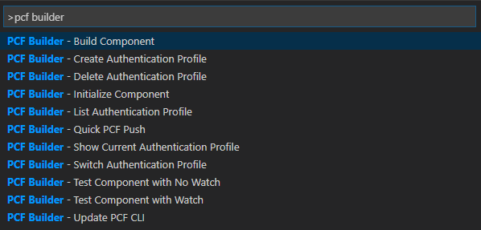
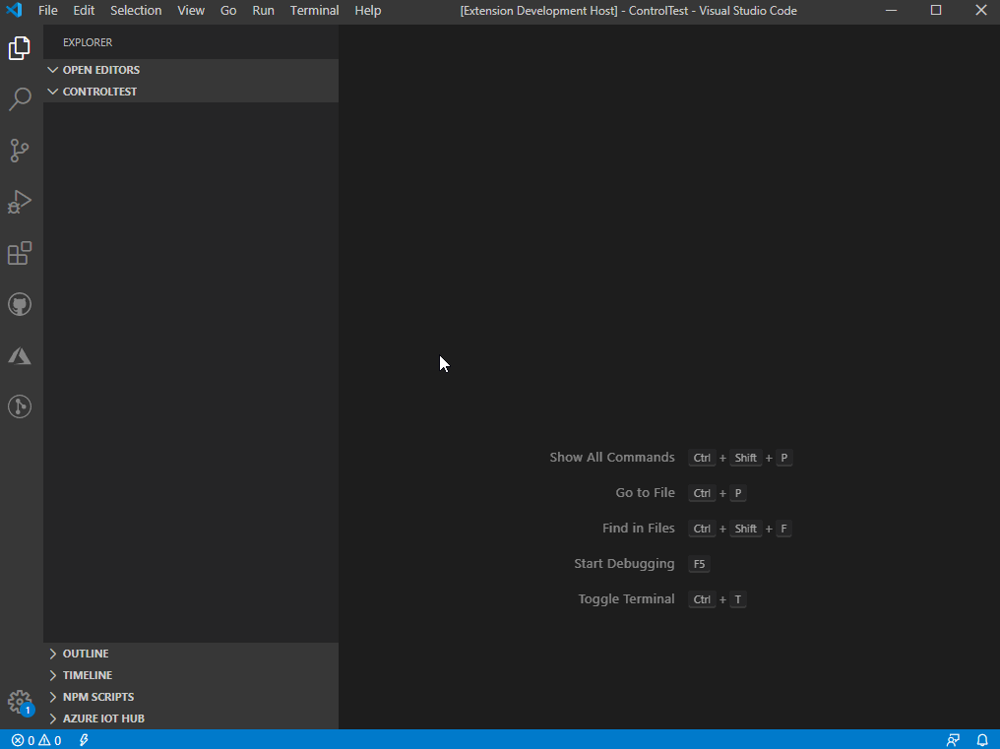
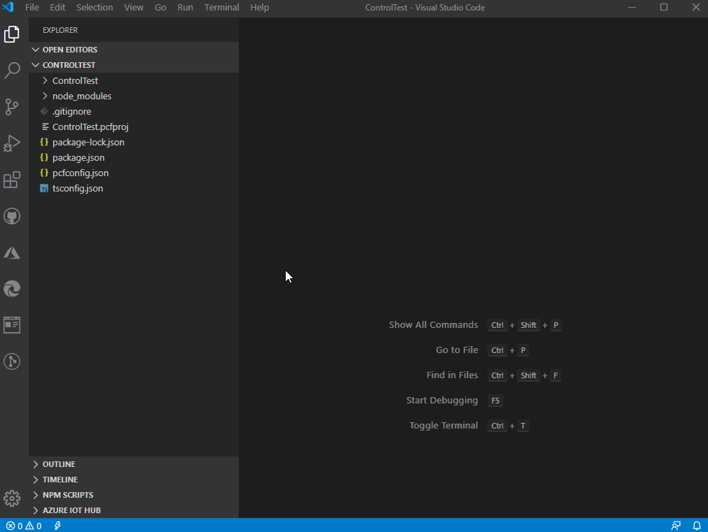
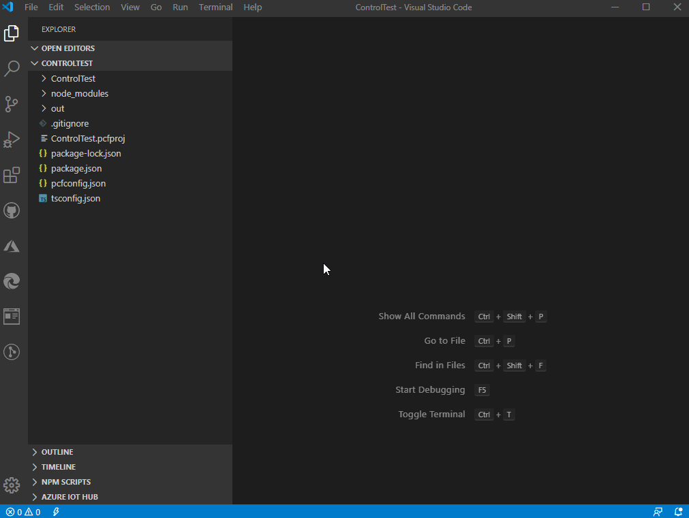
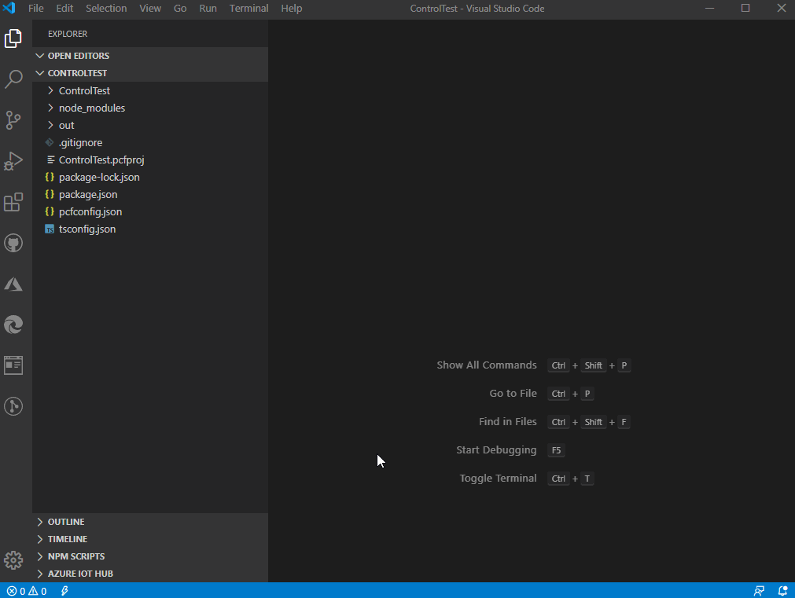

# PCF Builder

Build your Power Apps Component Framework custom controls faster. No need to rememeber the PCF CLI commands. All commands provided in one selection list for you to execute.

## Usage

View list of commands via `Ctrl+Shift+P` and type **PCF Builder**

## Requirements

Requires [npm](https://nodejs.org/en/) and [PCF CLI](https://aka.ms/PowerAppsCLI)

## List of all available commands

## Features

1. Initialize PCF control

2. Build & Test PCF control

3. Manage Authentication Profiles

4. Update PCF CLI

5. Quick Deploy using PCF Push

## Contributing

Found a bug? or have a feature request? - Create a pull request or an issue on [GitHub](https://github.com/Power-Maverick/PCF-Builder-VSCode)

## License

This software is released under [MIT License](http://www.opensource.org/licenses/mit-license.php)

## Release Notes

### 1.0.0

Initial release of PCF Builder

-------------------------------------------------------------------------------------------

**Enjoy!**
